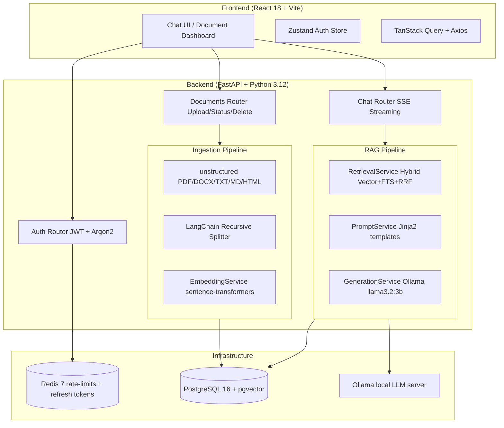

# Veridian — Intelligent Document Q&A Platform

> Upload any document. Ask anything. Get cited answers — streamed in real time.

Veridian is a **production-grade, multi-tenant RAG (Retrieval-Augmented Generation)** platform. Users upload PDF, DOCX, TXT, Markdown, or HTML files. Veridian parses, chunks, and embeds them, then lets users ask questions and receive accurate, source-cited answers generated by a local LLM — **entirely free, no API key required** with the default Ollama + sentence-transformers stack.

---

## Architecture



---

## Tech Stack

| Layer | Technology |
|-------|-----------|
| **Backend** | Python 3.12, FastAPI, Pydantic v2, SQLAlchemy 2.0 async |
| **Frontend** | React 18, TypeScript strict, Vite, TailwindCSS |
| **State** | TanStack Query v5, Zustand v5 |
| **Database** | PostgreSQL 16 + pgvector extension |
| **LLM** | Ollama (llama3.2:3b, local, free forever) |
| **Embeddings** | sentence-transformers (all-MiniLM-L6-v2, local, free) |
| **Auth** | JWT access + refresh tokens, Argon2 hashing |
| **Migrations** | Alembic (async) |
| **CI** | GitHub Actions (lint + test) |

---

## Prerequisites

| Tool | Version |
|------|---------|
| Docker | 24+ |
| Docker Compose | v2.20+ |
| Node.js _(local dev only)_ | 20+ |
| Python _(local dev only)_ | 3.12+ |

---

## Quick Start (Docker)

### 1. Clone and configure

```bash
git clone https://github.com/Aahana-0204/Veridian.git
cd Veridian
cp .env.example .env
```

Edit `.env` — set at minimum:

```bash
SECRET_KEY=<run: python -c "import secrets; print(secrets.token_hex(32))">
POSTGRES_PASSWORD=<choose a strong password>
```

### 2. Start all services

```bash
docker compose up --build -d
```

### 3. Pull the LLM model (one-time, ~2 GB)

```bash
docker compose exec ollama ollama pull llama3.2:3b
```

### 4. Run migrations

```bash
docker compose exec backend alembic upgrade head
```

### 5. Open the app

| Service | URL |
|---------|-----|
| Frontend | http://localhost:5173 |
| Backend API | http://localhost:8000 |
| API Docs | http://localhost:8000/docs |

---

## Local Development (without Docker)

### Backend

```bash
cd backend
python -m venv .venv && source .venv/bin/activate
pip install -r requirements.txt -r requirements-ml.txt -r requirements-dev.txt
docker compose up postgres redis ollama -d
alembic upgrade head
uvicorn app.main:app --reload --port 8000
```

### Frontend

```bash
cd frontend
npm install
# Create frontend/.env.local:  VITE_API_URL=http://localhost:8000
npm run dev
```

---

## Running Tests

```bash
# Backend (requires postgres + redis running)
cd backend
pytest tests/ -v --tb=short

# Frontend
cd frontend
npx tsc --noEmit
npm test
```

---

## Database Migrations

```bash
alembic upgrade head                        # apply all pending
alembic revision --autogenerate -m "desc"   # generate from model changes
alembic downgrade -1                        # rollback one step
alembic current                             # show current revision
```

---

## Environment Variables

All vars live in `.env` (copy from `.env.example`). Pydantic BaseSettings validates them at startup.

### Required

| Variable | Description |
|----------|-------------|
| `SECRET_KEY` | JWT signing secret (min 32 chars random hex) |
| `POSTGRES_PASSWORD` | PostgreSQL password |
| `DATABASE_URL` | Full asyncpg connection string |

### LLM Provider (pick one)

| Provider | Variables needed | Cost |
|----------|-----------------|------|
| **Ollama** (default) | `OLLAMA_BASE_URL=http://ollama:11434` | Free forever |
| Groq | `LLM_PROVIDER=groq`, `GROQ_API_KEY=gsk_...` | Free tier (30 req/min) |
| OpenAI | `LLM_PROVIDER=openai`, `OPENAI_API_KEY=sk-...` | Paid |

### Embedding Provider (pick one)

| Provider | Variables needed | Cost |
|----------|-----------------|------|
| **sentence-transformers** (default) | `EMBEDDING_PROVIDER=sentence-transformers` | Free forever |
| OpenAI | `EMBEDDING_PROVIDER=openai`, `OPENAI_API_KEY=sk-...`, `EMBEDDING_DIMENSIONS=1536` | Paid |

> If switching embedding providers, run `alembic upgrade head` — migration `c3d4e5f6a1b2` resizes the vector column (384 vs 1536).

### Full Reference

See `.env.example` for every variable with inline documentation.

---

## Production Build

```bash
# Build and run production images
docker compose -f docker-compose.prod.yml up --build -d

# Pull model (first time)
docker compose -f docker-compose.prod.yml exec ollama ollama pull llama3.2:3b

# Run migrations
docker compose -f docker-compose.prod.yml run --rm migrate
```

See [DEPLOYMENT.md](DEPLOYMENT.md) for full free-tier cloud deployment instructions (Supabase, Upstash Redis, Render, Vercel).

---

## Troubleshooting

**`pgvector extension not found`** — Use the `pgvector/pgvector:pg16` image; or run `CREATE EXTENSION IF NOT EXISTS vector;` manually.

**`password authentication failed`** — Password mismatch between `.env` and the Postgres volume. Run `docker compose down -v` then `up --build` (deletes data).

**`model "llama3.2:3b" not found`** — Run `docker compose exec ollama ollama pull llama3.2:3b`.

**Chat returns empty responses** — Check `docker compose ps ollama` and `curl http://localhost:11434/api/tags`.

**`alembic: Can't locate revision`** — Run `alembic current` to check state; `alembic history --verbose` to inspect the chain.

**sentence-transformers downloads on first upload** — The HuggingFace model (~90 MB) downloads once on first use. Requires outbound internet from the container.

**Rate limit on `/auth/login`** — 10 req/min per IP (Redis-backed). Flush dev: `docker compose exec redis redis-cli FLUSHDB`.

---

## Project Structure

```
Veridian/
├── backend/app/
│   ├── core/          # Config, DB, Redis, logging, deps
│   ├── models/        # SQLAlchemy ORM models
│   ├── schemas/       # Pydantic request/response models
│   ├── routers/       # FastAPI route handlers
│   ├── services/      # Business logic (auth, ingestion, chat)
│   ├── embeddings/    # EmbeddingProvider + implementations
│   ├── generation/    # GenerationProvider + Ollama/Groq/OpenAI
│   ├── retrieval/     # Vector, keyword, hybrid (RRF) retrieval
│   ├── reranking/     # CrossEncoder reranker (optional)
│   ├── prompts/       # Jinja2 templates + PromptService
│   └── storage/       # StorageBackend + LocalStorageBackend
├── backend/tests/     # pytest integration + unit tests
├── frontend/src/
│   ├── api/           # Typed API client functions + SSE helper
│   ├── components/    # AppShell, Modal, ProtectedRoute
│   ├── hooks/         # useChat streaming hook
│   ├── pages/         # Chat, Documents, Login, Register
│   └── store/         # Zustand auth store
├── migrations/        # Alembic versions
├── infra/             # nginx + postgres init
├── .github/workflows/ # lint.yml, test.yml
├── docker-compose.yml      # Dev
├── docker-compose.prod.yml # Production
├── DECISIONS.md            # Architecture Decision Records
├── DEPLOYMENT.md           # Free-tier cloud deployment
└── CHANGELOG.md            # Per-part history
```